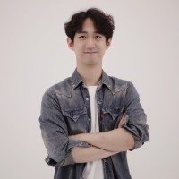

[최윤석]  
• 한양대학교 HCI 박사 재학 중  
• UIUC Computer Engineering 학사  
현) 왓츠라이프 스튜디오 대표  
현) 한양대학교 소프트웨어 융합대학 ICT융합학부 겸임교수  
전) 헬로브이알 이사  
 
[Book]  
• 손에 잡히는 유니티 3D VR/AR 출간  
  
[강의]  
• 고등학생 대상 가상현실 전문가 진로 교육 (부천고, 청심국제고 외 다수)  
• VR/AR 관련 강의 (아주대 미디어학과 외 다수)  
• VR/AR 콘텐츠 개발 강의 : RemainCast, FastCampus, Udemy, 세종대 등  
