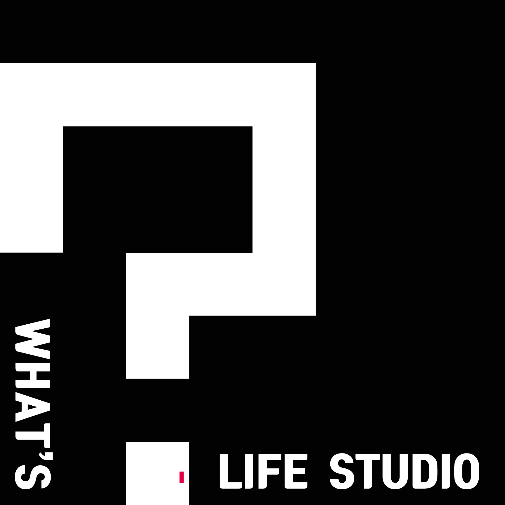

# What's Life Studio <VR&AR Contents Creation Lab>

`유니티3D`를 활용하여 `가상현실` 및 `증강현실` 인터렉티브 콘텐츠들을 만드는데 필요한 리소스들을 정리합니다. 콘텐츠 개발중 겪은 trouble shooting을 기록합니다.  

## Unity3D

`유니티3D`라는 게임 개발 툴을 이용해 가상현실 증강현실 콘텐츠들을 개발합니다. [https://unity.com](https://unity.com)

## Virtual Reality

가장 기본적인 `GoogleVR_SDK` 부터 `PICO VR` 같은 스탠드얼론 HMD나 `HTC VIVE` 사용법을 기록합니다.

## Augmented Reality

`Vuforia SDK` 의 활용법 그리고 `AR Foundation` 의 활용법도 기록합니다.

## Page Layouts

* Unity3D Basics
* Unity3D Fundamentals
* Unity3D GoogleVR
* Unity3D Vuforia
* Unity3D PicoVR
* Unity3D Vive
* Blog
* Post

## Supported By What's Life Studio

